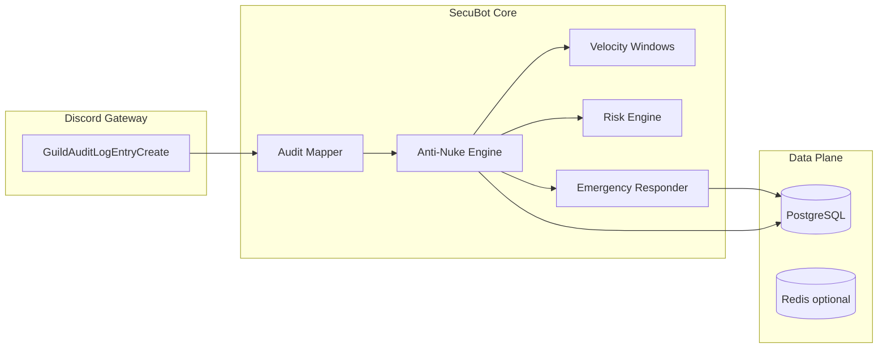

# SecuBot / Oryx — Enterprise Discord Security Platform

Upstream repository: `https://github.com/nxcta/oryx.git`

SecuBot is a **security-first** Discord protection system focused on **anti-nuke**, **audit-driven detection**, **deterministic risk scoring**, and **automated incident response**. It is designed as a foundation you can extend toward full SIEM-style operations, horizontal scaling, and worker-backed analytics.

## Why these technologies

| Layer | Choice | Rationale |
| --- | --- | --- |
| Runtime | **Node.js 20+** | Mature async I/O, excellent concurrency for gateway + REST fan-out, battle-tested Discord ecosystem. |
| Language | **TypeScript (strict)** | Strong contracts for security policies, safer refactors, better IDE enforcement across large teams. |
| Discord SDK | **discord.js v14** | Full gateway coverage, audit log entry streaming, mature sharding patterns. |
| Persistence | **PostgreSQL + Prisma** | ACID guarantees for incidents, immutable-style event logs, indexed forensics queries, migration discipline. |
| Cache / coordination | **Redis (optional)** | Distributed locks, shared velocity windows, job deduplication, rate-limit coordination across nodes. |
| Logging | **pino** | Structured JSON logs suitable for centralized ingestion (ELK, Datadog, OpenTelemetry bridges). |
| Config | **Zod** | Fail-fast validation for secrets and deployment identity (`NODE_ID`) — critical for zero-trust operations. |

**Security > stability > performance > UX** is reflected in defaults: aggressive thresholds, automatic lockdown paths (when enabled), and ephemeral operator-facing commands.

## Architecture (high level)



1. **Audit pipeline** listens to `GuildAuditLogEntryCreate`, normalizes actions, and feeds the **anti-nuke engine**.
2. The engine maintains **per-guild, per-actor velocity** (burst + sustained windows) and merges **deterministic risk** with **velocity breach bonuses**.
3. The **emergency responder** performs permission-aware mitigations (verification hardening, invite freeze, suspicious webhook removal on lockdown) and writes **append-only security events** + **incidents** to PostgreSQL.

## Quick start

1. Install dependencies (requires Node 20+ and npm on your PATH):

   ```bash
   npm install
   ```

2. Start infrastructure:

   ```bash
   docker compose up -d
   ```

3. Configure `.env` from `.env.example` and set `DISCORD_TOKEN`, `DISCORD_CLIENT_ID`, and `DATABASE_URL`.

4. Push schema:

   ```bash
   npm run db:generate
   npm run db:push
   ```

5. Run the bot:

   ```bash
   npm run dev
   ```

6. (Optional) Run the **Oryx control plane API** (licensing + tenant sessions):

   ```bash
   npm run api:dev
   ```

   Configure `AUDIT_PEPPER`, `ADMIN_API_TOKEN`, and `COOKIE_SECRET` (see `web/api-server/.env.example`).

### Required Discord settings

- Enable **Server Members Intent** and **Guild Moderation Intent** in the Discord Developer Portal (audit entry streaming and member-related forensics).
- Bot permissions: at minimum `View Audit Log`, `Manage Server`, `Manage Webhooks` for full automated response coverage (the responder **skips** actions it cannot safely perform).

### Operator hardening

Set `TRUSTED_OPERATOR_IDS` to a comma-separated list of user IDs allowed to run `/security simulate` (simulation **mutates live velocity state** by design). Leave empty only in controlled environments.

## Slash commands

- `/security status` — shows active anti-nuke thresholds for the guild (from persisted policy + live engine).
- `/security analyze` — deterministic heuristic scan for phishing / token-grabber / nitro-scam style text (no external LLM; safe for regulated environments).
- `/security simulate` — operator-only dry-run that still records velocity (explicit warning in UI).

## Repository layout

- `src/security/` — risk engine, anti-nuke engine, velocity tracker, engine registry.
- `src/discord/` — audit mapping, audit pipeline wiring, REST command registration.
- `src/incidents/` — emergency responder (automated mitigations + forensic append).
- `src/services/` — Prisma-backed incident recording and guild policy service.
- `src/persistence/` — Prisma client factory.
- `src/infrastructure/` — optional Redis wiring (extend with distributed velocity + BullMQ-style workers).
- `src/plugins/` — typed extension surface for **vetted** modules (not arbitrary user sandboxing).

## Control plane (dashboards + API)

The Discord bot is the **data plane**. The commercial SaaS surface is a separate **control plane** with isolated deployables under `web/`:

- `web/api-server/` — **Fastify** control API (licensing keys, redemption, tenant sessions, control audit) — run: `npm run api:dev`
- `web/admin-dashboard/` — internal SOC / dev console (Next.js bootstrap; SSO, IP-restricted)
- `web/owner-dashboard/` — tenant server-owner console (Next.js bootstrap; scoped to a single guild)

Operational hardening, hosting topology, licensing/key cryptography, CI/CD, DR, and launch gating are documented in:

- `docs/ENTERPRISE_PRODUCTION_AND_OPERATIONS.md`
- `docs/DEPLOY_AND_RUN.md` (end-to-end run + env wiring)
- `docs/WISPBYTE_BOT_HOSTING.md` (Discord bot on Wispbyte — **choose Node.js**)

## Tests

```bash
npm test
```

## Roadmap (recommended next increments)

1. **Redis-backed velocity** + distributed locks (replace in-memory `VelocityTracker` per node).
2. **Shard coordinator** (`ShardingManager` + per-shard health metrics) for 100k+ member fleets.
3. **Message layer** automod (join floods, scam URLs, attachment reputation) feeding the same risk engine.
4. **Snapshot / rollback** workers: scheduled permission snapshots + channel topology hashes (`PermissionSnapshot` model is ready for expansion).
5. **Approval workflows** for dangerous staff actions using interactive components + quorum rules.

## Legal / safety notice

Automated moderation and lockdown tooling can cause **real harm** if misconfigured. Run staging drills, keep break-glass owner access, and ensure your team understands Discord ToS, privacy obligations, and regional regulations.
