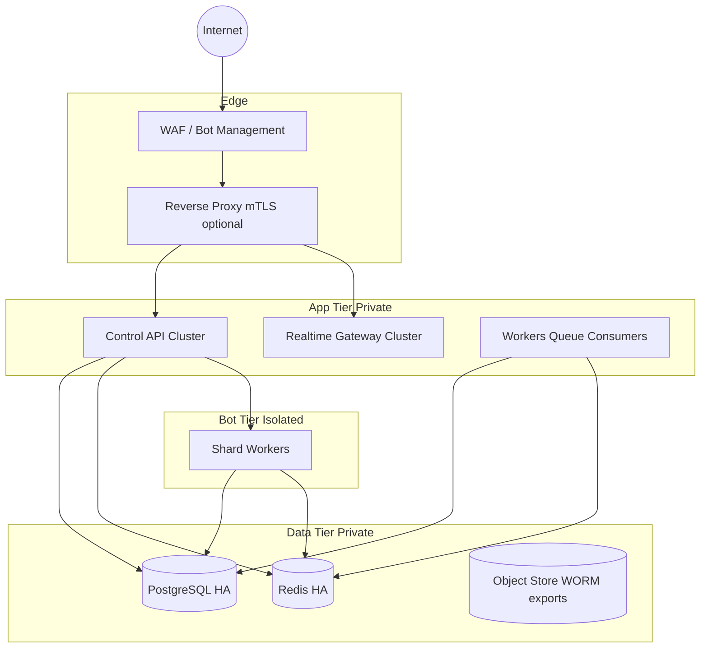

# SecuBot Platform — Enterprise Production, Operations, and Web Control Plane

Audience: senior DevSecOps, platform engineering, security architecture, and backend owners preparing a **commercial-grade cybersecurity SaaS** around a Discord protection bot.

This document describes **what happens after feature development stabilizes** and **before public commercial operation**: hosting topology, control-plane separation, key-based tenancy, deployment workflows, observability, incident response, and hardening that matches regulated SaaS expectations.

Assumptions:

- The **data plane** (Discord bot + gateway consumers) is separate from the **control plane** (HTTP APIs + dashboards + operator automation).
- You operate under **zero trust** between services: every hop is authenticated, authorized, audited, rate limited, and observable.
- **Secrets never enter git**, chat, tickets, or CI logs. Rotation is routine, not emergency-only.

---

## 0) Non-negotiables before any public launch

1. **Secret hygiene**: all bot tokens, OAuth client secrets, DB passwords, signing keys for licenses, and session encryption keys live in a **managed secret manager** (AWS Secrets Manager / GCP Secret Manager / Azure Key Vault / HashiCorp Vault). Local `.env` is dev-only.
2. **Separate production AWS/GCP/Azure accounts** (or equivalent) from staging; **no shared IAM**, **no shared KMS keys**, **no shared DB clusters** across env boundaries.
3. **Separate DNS zones** and **separate TLS certificates** for:
   - `api.prod…` (control plane API)
   - `admin.prod…` (internal SOC console)
   - `console.prod…` (tenant/server-owner console)
4. **Break-glass**: two humans can restore access without Discord dashboard dependency; **out-of-band** runbooks stored outside the primary cloud account.
5. **Legal/compliance**: data retention, DPA templates, subprocessors list, customer notification policy, and abuse contact published **before** marketing.

---

## 1) Target reference architecture (production)

### 1.1 Logical zones

| Zone | Purpose | Exposure |
| --- | --- | --- |
| **Edge** | TLS termination, WAF, bot management, geo policy, request size limits | Public Internet |
| **DMZ / Edge services** | Reverse proxy (Traefik/Caddy/Envoy), optional CDN for static assets only | Public |
| **App tier (stateless)** | API servers, websocket fanout workers, background job consumers | Private subnets; ingress via LB only |
| **Data tier** | PostgreSQL (HA), Redis (HA), object storage for exports | Private subnets; no public IP |
| **Bot runtime** | Discord gateway shard workers + optional REST proxy pool | Outbound-only to Discord; inbound admin via mTLS from ops bastion only |
| **Observability** | OTel collectors, Prometheus remote write, log shipper | Restricted egress + inbound from SIEM |

### 1.2 Physical topology (recommended baseline)

Use **three availability zones** minimum for any HA claim.

**Why split bot from API**: Discord tokens and gateway pressure are a different blast radius than customer dashboards. A compromised web dependency must not equal immediate token theft on the same host.

### 1.3 Service responsibilities

| Service | Responsibilities | Notes |
| --- | --- | --- |
| **Discord bot** | Ingest gateway events, enforce server policy, emit security events to message bus | Runs with **least privilege** token scopes; separate DB schema or separate DB |
| **Control API** | AuthN/Z, license redemption, RBAC, audit append, admin actions, tenant config CRUD | **No** Discord token on this service |
| **Realtime gateway** | Websocket/SSE fanout for dashboards; subscribe to Redis Streams/Kafka topics | Must enforce per-tenant channel isolation |
| **Workers** | Heavy analytics, exports, snapshot jobs, email/webhook notifications | Autoscale on queue depth |
| **Admin console (web)** | Internal SOC UI; talks only to API with **admin-only** roles | Deployed behind IP allowlist + SSO where possible |
| **Owner console (web)** | Tenant UI; scoped to `guild_id` claims | Separate build, separate origin, separate CSP |

---

## 2) Technology selections (security-weighted)

These choices optimize for **security, operability, and long-term maintainability** at SaaS scale—not tutorial simplicity.

### 2.1 Frontend (both consoles)

- **Next.js (App Router) + React + TypeScript** (two separate apps: `web/admin-dashboard`, `web/owner-dashboard`).
- **Styling**: Tailwind CSS + headless component primitives (Radix) for accessibility; **dark-first** theme tokens.
- **Data fetching**: TanStack Query for cache discipline; **server components** where possible to reduce token exposure in browser.
- **Why separate apps**: prevents accidental bundling of admin-only routes/components; enables **different CSP**, **different release cadence**, and **different authentication cookies** (`admin` vs `tenant`).

### 2.2 Backend API

- **NestJS (Node LTS) + TypeScript** for modular boundaries (Auth, Tenancy, Billing, Admin, Realtime tokens), built-in DI, guards, interceptors, OpenAPI.
- Alternative acceptable at high performance: **Fastify** + Zod + custom RBAC—but you asked for enterprise patterns; NestJS wins on uniformity.

### 2.3 Runtime

- **Node.js 22 LTS** (or 20 LTS if org policy) with **strict** TS, **undici** fetch, **worker_threads** for CPU-heavy parsing jobs behind queues.

### 2.4 Primary database

- **PostgreSQL 16+** with:
  - **Row Level Security (RLS)** for tenant tables (`guild_id` scoping), enforced even if application bugs leak queries.
  - **Partitioning** for append-only tables (`security_event_log`, `audit_log_mirror`) by time.
  - **PITR** backups + **logical replication** to DR region for RPO/RTO targets.

### 2.5 Cache / coordination / sessions

- **Redis (Cluster mode)** for:
  - short-lived session handles,
  - rate limiting counters,
  - websocket presence maps,
  - distributed locks (Redlock with caution; prefer fencing tokens for correctness),
  - pub/sub or **Redis Streams** as a pragmatic bus before Kafka.

### 2.6 Message bus / jobs

- **Kafka** (or Redpanda) when event volume and replay requirements justify ops cost; otherwise **Redis Streams + consumer groups** until measured pain.
- **Temporal** (optional) for durable workflows: “restore snapshot”, “multi-step incident”, “approval gates”.

### 2.7 Websocket stack

- **Socket.IO with Redis adapter** *or* **uWebSockets.js** behind a custom protocol with explicit auth handshake.
- Hard requirement: **per-connection authorization** revalidated on subscription; **no cross-tenant topics**.

### 2.8 Reverse proxy / edge

- **Envoy** or **Traefik** or **Caddy** at the edge; pick one your team can operate. Enterprise teams often standardize on **Envoy + Istio/Linkerd** if Kubernetes is already mandated.

### 2.9 Hosting / cloud

Pick one primary hyperscaler and execute consistently:

- **AWS**: EKS or ECS Fargate + RDS + ElastiCache + ALB + WAFv2 + Shield Advanced (if DDoS budget exists) + KMS + Secrets Manager + CloudWatch + X-Ray + Firehose to SIEM.
- **GCP**: GKE or Cloud Run + Cloud SQL + Memorystore + Cloud Armor + Cloud KMS + Secret Manager + Cloud Logging + Chronicle optional.
- **Azure**: AKS + Postgres Flexible Server + Azure Cache for Redis + Front Door + WAF + Key Vault + Defender for Cloud.

**Bot hosting**: separate autoscaling group / node pool with **tighter IAM**, **no inbound ports**, **egress allowlist** to Discord + your API only.

### 2.10 CDN

- CDN only for **static assets** (fonts, js/css bundles) with **immutable caching** and **SRI** where applicable. **Never** CDN-cache authenticated HTML.

### 2.11 Monitoring / logging / tracing

- **OpenTelemetry** end-to-end (browser optional; server mandatory).
- **Prometheus + Grafana** (or managed: AMP/AMG, Datadog, New Relic).
- **Loki / ELK / OpenSearch** for logs; **SLO dashboards** per service.
- **SIEM**: forward security audit events with **immutable** retention (WORM bucket + hash-chained rows optional).

### 2.12 Authentication stack (recommended composition)

- **Internal admin console**: **SSO** (Okta/AzureAD) + **hardware/WebAuthn step-up** for destructive actions.
- **Tenant console**: **Key redemption** establishes a **tenant session** bound to `guild_id` + optional **Discord OAuth** as secondary proof of ownership (recommended for anti-impersonation).
- **Service-to-service**: **mTLS** inside mesh OR **SPIFFE/SVID**; short-lived JWTs signed by internal OIDC provider (Zitadel/Keycloak) if mesh not available.

---

## 3) Licensing / access key system (cryptographic and operational design)

This is the **root of trust** for server-owner access. Treat it like API keys for a cloud product.

### 3.1 Threat model (minimum)

- Keys can leak via screenshots, phishing, paste sites, compromised owner machines.
- Insider admins can mint arbitrary keys unless **dual control** is enforced for issuance above certain quotas.
- Replay attacks against redemption endpoint must fail.
- Stolen DB must not yield usable long-lived secrets without KMS envelope encryption.

### 3.2 Key format (operator-facing)

Human operators distribute **one-time redemption codes** that map to DB rows, not raw signing material.

Recommended pattern:

1. Generate 256-bit random secret `R` (CSPRNG).
2. Store only `H = SHA256(R)` (or HMAC with server pepper) in DB with metadata: `issuer_id`, `created_at`, `expires_at`, `max_uses=1`, `status`, `scopes`, `target_guild_id?` (nullable until bound).
3. Display to operator as `prefix + base32url(R)` for readability; **never** store `R` after handoff—only `H`.

Redemption:

1. Client submits `R` over TLS 1.3.
2. Server computes `H`, looks up row, verifies not expired/revoked, verifies rate limits, verifies IP reputation tier.
3. Transaction: bind `guild_id` (from Discord OAuth proof or from admin-assigned target), mark redeemed, mint **session artifacts** (see §4).

### 3.3 Admin capabilities (key lifecycle)

- **Generate** with explicit scopes: `OWNER_CONSOLE_READ`, `OWNER_CONSOLE_WRITE`, `MODULE_AUTOMOD`, etc.
- **Suspend** / **revoke** with reason codes; immediate session invalidation via Redis session version bump.
- **Audit** every mint/redeem/revoke with actor identity (admin SSO subject), IP, user-agent hash, correlation id.

### 3.4 Anomaly detection (baseline)

- redemption failures spike from ASN / country not aligned with guild locale
- multiple redemption attempts with different guild bindings
- owner console API calls without prior successful Discord OAuth when policy requires it

---

## 4) Session and browser security model

### 4.1 Cookies (tenant and admin separated)

- **Names**: `__Host-admin_session` and `__Host-tenant_session` (prefix requires `Secure`, `Path=/`, no Domain cookie).
- **Flags**: `HttpOnly`, `Secure`, `SameSite=strict` (lax only if you accept CSRF tradeoffs on top-level navigations—prefer strict + explicit OAuth return handling).
- **Rotation**: session ID rotates on privilege elevation; idle timeout + absolute max lifetime.

### 4.2 CSRF

- For cookie-authenticated mutations: **double-submit cookie** + **anti-CSRF token** in header for state-changing requests, or **SameSite=strict** + ensure all mutations are `fetch` from same site (still keep token for defense-in-depth).

### 4.3 CSP (baseline policies)

**Admin console (stricter)**

- `default-src 'self'`
- `script-src 'self'` + strict nonce for inline (avoid `'unsafe-inline'`)
- `style-src 'self'` + nonce (or hash) if using CSS-in-JS carefully
- `img-src 'self' data: https://cdn.discordapp.com` (tighten further)
- `connect-src 'self' https://api…` + websocket origin
- `frame-ancestors 'none'`
- `base-uri 'none'`

**Owner console**

- Same baseline; **narrower** `connect-src` if tenant API host differs.

### 4.4 XSS defenses

- React escaping defaults + **no `dangerouslySetInnerHTML`** unless sanitized pipeline approved by security review.
- **Trusted Types** where supported; set `Content-Security-Policy` reporting endpoints.

### 4.5 SQL injection

- Prisma OR parameterized queries only; forbid raw SQL except migrations with review.
- **RLS** as second line of defense.

### 4.6 WebSocket security

- Do not pass long-lived tokens in query strings (logs leak). Prefer:
  - short-lived **WS ticket** minted by API after cookie session validated, delivered via POST body, consumed once; or
  - **mTLS** internal channels only.

---

## 5) RBAC matrix (minimum viable enterprise)

### 5.1 Admin roles

| Role | Capabilities |
| --- | --- |
| `SUPERADMIN` | Full infra actions, key minting unlimited, destructive controls |
| `SOC_OPERATOR` | Read all tenants, acknowledge incidents, export logs |
| `SUPPORT_TIER1` | Read limited fields, cannot export raw security logs |
| `RELEASE_MANAGER` | Feature flags, progressive rollouts, maintenance banners |

Enforce **step-up auth** for: global broadcast, maintenance mode, mass config changes, backup restores.

### 5.2 Tenant roles (per guild)

| Role | Capabilities |
| --- | --- |
| `GUILD_OWNER` | Full tenant config |
| `GUILD_ADMIN` | subset: automod, thresholds |
| `GUILD_AUDITOR` | read-only analytics |

Bind roles to **Discord user IDs** verified via OAuth; store mapping in DB with RLS.

---

## 6) Dashboard systems (two products, one platform)

### 6.1 Admin / dev dashboard (internal)

**Primary surfaces**

- **Global fleet**: all guilds where bot is present; columns: guild id, name, icon URL (proxy through your CDN with caching policy), member count, shard id, last heartbeat, computed threat level, incident counts (24h/7d), policy version drift.
- **Live operations**: websocket feed of `security_event_log` tail (filtered), incident queue, deploy/version panel, feature flags, maintenance toggles.
- **Infrastructure**: RED/YELLOW/GREEN panels for API p95, WS connect rate, DB replication lag, Redis memory headroom, queue backlog, error budget burn.

**Dangerous controls** (must be gated)

- global bot presence change
- global announcement broadcast
- emergency lockdown triggers (define blast radius: single guild vs cohort)
- service restart hooks (only via authenticated automation to orchestrator API)

### 6.2 Server owner dashboard (external)

**Primary surfaces**

- **Mission control**: threat dial, active incidents, recent mitigations, join velocity, automod hits.
- **Configuration**: thresholds, trusted roles, alert destinations, verification flows, backups.
- **Forensics**: searchable security timeline with export (RBAC + legal retention).

**Hard isolation requirements**

- API must enforce `WHERE guild_id = :authorized_guild` at **app layer** and **RLS** at DB.
- Admin endpoints must live in **separate route module** compiled with separate global prefix (`/internal/...`) and blocked at edge for non-admin networks.

---

## 7) Real-time architecture (scalable)

### 7.1 Event flow

1. Bot writes canonical events to **append-only stream** (`security.events.v1`) with `guild_id`, `correlation_id`, `severity`, `payload`.
2. API **projection workers** materialize rollups (threat score windows) into Redis + Postgres aggregates.
3. Realtime gateway subscribes to stream filtered by shard mapping:
   - admin connections: global filter with role check
   - tenant connections: per-guild channel only

### 7.2 Backpressure

- Per-connection rate limits; drop-oldest ring buffers client-side; server-side max queue per socket.
- If Redis pubsub overload: migrate to Kafka consumer with keyed partitions by `guild_id`.

---

## 8) Deployment model (staging → canary → production)

### 8.1 Environments

- **dev**: local docker compose; synthetic data; no production secrets.
- **staging**: production-like topology, smaller SKUs, anonymized snapshot of schema only (never prod PII).
- **prod**: HA, multi-AZ, change windows, freeze calendar.

### 8.2 CI/CD (GitHub Actions baseline)

- **OIDC** to cloud roles (no long-lived cloud keys in GitHub secrets).
- Pipelines:
  - `lint/type/test` on PR
  - `build images` with SBOM (Syft) + sign (Cosign)
  - `deploy staging` on merge to `main`
  - `promote canary` manual approval for prod
- **Immutable artifacts**: container digest promoted, not rebuilt.

### 8.3 Database migrations

- Prisma migrate (or Flyway) with **expand/contract** pattern for zero-downtime.
- Backups verified by automated restore test weekly.

---

## 9) Step-by-step production bring-up (operator runbook)

> This is a **sequence**, not a menu. Adjust cloud names to your provider.

### Phase A — Landing zone (Day 0–2)

1. Create **prod** account/subscription; enable centralized logging; deny public S3/R2 buckets by policy.
2. Create **VPC/VNet** with private subnets for data tier; public subnets only for LBs.
3. Provision **KMS/KeyVault** keys: `app-data`, `backup`, `tls`, `jwt-signing` (HSM-backed if contract requires).
4. Create **managed Postgres** with:
   - encryption at rest,
   - TLS required,
   - HA + automated failover,
   - restricted security groups,
   - `pg_audit` or cloud audit logs enabled.
5. Create **Redis** cluster mode with TLS + AUTH + restricted SGs.
6. Create **object storage** bucket for exports with **object lock** (WORM) for forensic bundles.

### Phase B — Edge and ingress (Day 2–4)

1. Register domains: `api.`, `admin.`, `console.` under prod zone.
2. Issue **TLS certs** (ACM / Google-managed / cert-manager Let’s Encrypt internal).
3. Deploy **WAF** rules: OWASP CRS, geo allow/deny (if applicable), IP reputation, rate limits, size limits, block common SSRF paths on admin host.
4. Deploy **reverse proxy** with:
   - HSTS (start short max-age, increase after validation),
   - HTTP/2 or HTTP/3,
   - request ID propagation,
   - optional mTLS between proxy and apps.

### Phase C — Control plane services (Day 4–10)

1. Deploy **API** containers (autoscaling on CPU + p95 latency + queue depth signals).
2. Deploy **Realtime gateway** with Redis adapter; enforce auth handshake.
3. Deploy **workers** for exports, rollups, notifications.
4. Wire **secrets** from manager; validate startup: fail closed if secret version mismatch.
5. Enable **OTel** exporters + RED metrics.

### Phase D — Bot fleet (parallel)

1. Build bot image; run as **stateless** workers except local shard state; connect to Redis/DB as designed.
2. Lock outbound egress to Discord + your API endpoints only (firewall/SG egress rules).
3. Run **shard manager** (discord.js ShardingManager or orchestrated replicas) with health checks.

### Phase E — Web consoles (Day 6–12)

1. Deploy **admin** Next.js to internal-only ingress + SSO + IP allowlist (or private link).
2. Deploy **owner** Next.js to public ingress with stricter WAF and bot management rules.
3. Configure **CSP reporting** endpoints and triage process.

### Phase F — Data protection + DR (Day 8–14)

1. Backup policy: Postgres PITR + nightly logical dump to WORM bucket (encrypted).
2. DR drill: restore into isolated env; validate migrations + RLS policies.
3. Key rotation drill: JWT signing key rotation without downtime (multi-key verify window).

### Phase G — Security validation (Day 12–18)

1. **Third-party pentest** scope includes: tenant isolation, WS authz, key redemption, SSRF on admin actions, IDOR on guild routes, JWT/cookie attacks, rate limit bypass, deserialization, supply chain.
2. **DAST** + **SAST** in CI; block deploy on criticals.
3. **Tabletop**: bot token leak, ransomware on cloud account, insider admin abuse.

### Phase H — Launch checklist (gate)

- [ ] RLS verified with automated tests for cross-tenant reads
- [ ] Admin routes unreachable from public internet unless explicitly required
- [ ] On-call rotation configured; paging tested
- [ ] Runbooks: incident, abuse report, law enforcement request, customer data deletion
- [ ] Status page + comms templates
- [ ] Rate limits verified under load test
- [ ] Secrets rotation SOP published

---

## 10) Firewalling, DDoS, and abuse resistance

- **Edge**: WAF + bot management; challenge suspicious ASNs for owner console login endpoints only if UX allows.
- **API**: strict per-IP and per-tenant quotas; exponential backoff headers; circuit breakers to DB.
- **Bot**: separate rate limit strategy; prioritize safety-critical paths.
- **Operational**: separate admin VPN / ZeroTrust access to infra APIs.

---

## 11) Observability and SLOs (examples)

Define SLOs early (examples):

- API availability **99.95%** monthly
- p95 API latency < **250ms** for read dashboards (excluding heavy exports)
- WS delivery latency p95 < **2s** for security events
- Bot command acknowledgement p95 < **1.5s** (Discord-dependent; measure honestly)

Alert on:

- DB replication lag > threshold
- Redis memory > 80% with eviction happening
- error rate spike by deployment version
- redemption anomaly score

---

## 12) “Go-live” operational workflows

### 12.1 Daily

- review overnight incidents, error budget, security audit stream anomalies
- verify backup success markers

### 12.2 Weekly

- dependency updates (Renovate) with security priority lane
- access review for admin SSO groups
- load test subset in staging

### 12.3 Monthly

- key rotation, TLS cert review, DR restore test
- tabletop mini-scenario

---

## 13) What was intentionally not simplified

- Separate consoles and separate cookies reduce catastrophic cross-tenant XSS impact.
- RLS is not optional for multi-tenant security products.
- WS auth is a first-class design problem, not an afterthought.
- Licensing keys are **database-backed, hashed, one-time**—not “JWT as license” handed to customers without revocation story.

---

## 14) Repository layout for web code (this repo)

Web applications live under `web/` as **separate deployables**:

- `web/api-server/` — NestJS control plane API (bootstrap instructions inside)
- `web/admin-dashboard/` — internal SOC console (Next.js)
- `web/owner-dashboard/` — tenant/server-owner console (Next.js)

The Discord bot remains at the repository root (`src/`, `prisma/`) to preserve the existing runtime.

---

## 15) Immediate action if credentials were exposed in chat

If any bot token, OAuth secret, DB password, or private key was pasted into a chat system:

1. **Revoke/rotate** in the originating provider immediately.
2. Invalidate derived sessions in Redis.
3. Audit access logs for misuse window.
4. Post-incident: tighten secret distribution (Vault + short TTL + break-glass only).

---

## Appendix A — Minimal API route map (control plane)

- `POST /v1/auth/admin/sso/callback` (internal)
- `POST /v1/auth/tenant/redeem` (one-time key → session bootstrap)
- `POST /v1/auth/tenant/discord/oauth/callback` (recommended ownership proof)
- `GET /v1/admin/guilds` (paginated, SOC)
- `GET /v1/admin/guilds/:id/timeline`
- `POST /v1/admin/guilds/:id/actions/*` (step-up protected)
- `GET /v1/tenant/guild` (single guild projection)
- `GET /v1/tenant/events/stream` (websocket upgrade server)

---

## Appendix B — Hardening checklist (compressed)

- TLS everywhere; HSTS; modern cipher suites; OCSP stapling
- WAF; rate limits; bot management; geo policies where justified
- CSP, clickjacking protections, MIME sniffing protections
- SSRF controls on any “fetch URL” admin utilities
- Secrets in vault; KMS envelope encryption for sensitive columns
- RLS + least privilege DB users per service role
- Immutable audit storage for security events
- CI signing, SBOM, dependency scanning, SAST/DAST
- On-call, paging, SLO-based alerts

---

End of document. Treat updates to this file as **controlled configuration**: PR review + security sign-off for material changes.
